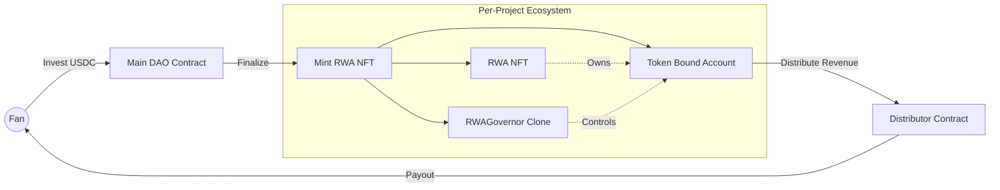

# 🎵 MelodyBond: A New Harmony Between Artists and Fans


<div align="center">

**The first decentralized protocol where fans become the record label.** Invest in artists, govern their career via DAO, and earn royalties directly through Token Bound Accounts.

[](./LICENSE)
[]()
[]()
[]()

[**🎥 WATCH THE LIVE DEMO**](https://youtu.be/M7pl_gSCFAQ) | [**🚀 LAUNCH DAPP**](https://melody-bond-app-link.com)

</div>

---

## 📖 Table of Contents

- [💥 The Problem](#-the-problem)
- [💡 The Solution](#-the-solution)
- [✨ Key Features](#-key-features)
- [🏗 Architecture & Tech Stack](#-architecture--tech-stack)
- [🔥 How It Works (The Flow)](#-how-it-works-the-flow)
- [📜 Deployed Contracts](#-deployed-contracts)
- [🛠 Getting Started](#-getting-started)
- [👥 Authors](#-authors)
- [📄 License](#-license)

---

## 💥 The Problem

The music industry value chain is broken.
- **Artists** often give up **90%** of their future revenue to labels just to get funded.
- **Fans** are the ones discovering talent, but they remain passive consumers.
- **The Reality:** With 12M+ artists on Spotify, less than **0.2%** earn a living wage.

## 💡 The Solution

**MelodyBond** is a DeFi protocol that removes the intermediaries. It allows artists to raise capital directly from fans in exchange for equity in their future revenue.

It’s not just crowdfunding; it’s **tokenized ownership**.
- **For Artists:** Instant funding without predatory contracts.
- **For Fans:** Become the label. Vote on decisions and earn a share of the profits.

---

## ✨ Key Features

### 1. 🏦 RWA + DAO (Per-Asset Governance)
Every funded project automatically mints a **Real-World Asset (RWA) NFT** and deploys a unique **RWAGovernor (DAO)** contract. This ensures that governance is granular—investors only manage the specific songs they funded.

### 2. ⛽ Gasless Experience (Account Abstraction)
"DeFi is not everywhere if it costs gas."
We implemented a custom **VotingPaymaster** using **ERC-4337 (Pimlico)**.
- **Gasless Investing:** Users pay 0 ETH transaction fees.
- **Gasless Voting:** Governance participation is 100% free.

### 3. 💼 Token Bound Accounts (The "Killer Feature")
We utilize **ERC-6551** to give every RWA NFT its own smart contract wallet (Treasury).
- The funds sit **inside the NFT**, not in a central pool.
- The DAO controls the NFT, and the NFT controls the funds.
- Enables **automated, proportional profit distribution** to all shareholders.

---

## 🏗 Architecture & Tech Stack

The system is built on a robust stack ensuring security and scalability.

### Tech Stack
* **Frontend:** Next.js 14, TypeScript, TailwindCSS
* **Blockchain Interaction:** viem, wagmi, Pimlico (Bundler/Paymaster)
* **Smart Contracts:** Solidity, Foundry
* **Standards:** ERC-721 (NFT), ERC-20 (GovToken), ERC-4337 (AA), ERC-6551 (TBA), OpenZeppelin Governor.

### System Architecture



## 🔥 How It Works (The Flow)

### 1. Investment (Gasless) 💸
Fans browse projects on the dashboard. They sign a transaction to invest USDC using our custom **VotingPaymaster**.
* **User Action:** Sign message (No ETH required).
* **On-Chain:** The Paymaster sponsors the gas, and the DAO records the user's contribution as **Shares**.

### 2. The Setup (Automated) ⚙️
Once a project is fully funded, the `DAO.sol` triggers a **single atomic transaction** that establishes the entire governance structure:
1.  **Mints the RWA NFT:** Represents the intellectual property on-chain.
2.  **Deploys the Governor:** A clone of `RWAGovernor.sol` specific to this NFT.
3.  **Creates the TBA Treasury:** An ERC-6551 Token Bound Account that belongs to the NFT.

### 3. Governance & Voting 🗳️
Investors view their portfolio. Their **Shares = Voting Power**.
* **Proposals:** Investors can propose to change metadata (e.g., fix a typo), update artwork, or distribute revenue.
* **Voting:** Voting is weighted by shares and is also **100% gasless**.

### 4. The Payday (Automated Distribution) 💰
This is our proprietary profit distribution engine:
1.  **Revenue Accumulation:** Streaming royalties (USDC) are sent to the NFT's TBA address.
2.  **Proposal:** An investor proposes "Withdraw Funds".
3.  **Execution:** Upon passing, the Governor instructs the TBA to approve the **Distributor** contract.
4.  **Distribution:** The Distributor contract pulls the funds and automatically airdrops the exact proportional share to every single investor's wallet in one loop.

---

## 📜 Deployed Contracts

All contracts are deployed and verified on **Sepolia Testnet**.

| Contract Name | Address | Description |
| :--- | :--- | :--- |
| **DAO Factory** | `0x93793508d9Aa1B6ECf6E92B470d8daB0D32BaC91` | Core logic & share accounting |
| **VotingPaymaster** | `0xD3b84c0C5c5c46f38ea00417a7b64285F1A72849` | Sponsors gas for users (ERC-4337) |
| **RWA NFT** | `0x3D01e38F75f5B82b48A878C25c4F1d1c5a2F9E0a` | The Asset (ERC-721) |
| **GovToken** | `0x5a679bDB706EBd1dCD8225A3F8b28C78e69D0CbF` | Used for main DAO voting |
| **Distributor** | `0x4744C6D6749Af15eaCCf3c36ECec8e045a4B3afa` | Handles proportional payouts |
| **EntryPoint** | `0x5FF137D4b0FDCD49DcA30c7CF57E578a026d2789` | Standard ERC-4337 EntryPoint |

---

## 🛠 Getting Started

To run the project locally, follow these steps.

### Prerequisites
- **Node.js** (v18 or higher)
- **Foundry** (Forge, Cast, Anvil)
- **Git**

### 1. Clone the Repository
```bash
git clone [https://github.com/MilanSazdov/Melody-Bond.git](https://github.com/MilanSazdov/Melody-Bond.git)
cd Melody-Bond
```

### 2. Setup Frontend

Navigate to the frontend directory and install dependencies:

```Bash
cd frontend
npm install
# Create .env.local file with your Privy/Alchemy keys (see .env.example)
npm run dev
```

Create a .env.local file in the frontend/ directory with your keys (see .env.example):

```bash
NEXT_PUBLIC_PRIVY_APP_ID=your_privy_id
NEXT_PUBLIC_ALCHEMY_API_KEY=your_alchemy_key
NEXT_PUBLIC_PIMLICO_API_KEY=your_pimlico_key
```

Run the development server:
```bash
npm run dev
```

Open http://localhost:3000 with your browser.


### 3. Setup Backend (Contracts)

Navigate to the backend directory:

```Bash

cd backend
forge install
forge build
```
To run tests:
```bash
forge test
```

---

## 👥 Authors

Project developed by:

* **Lazar Sazdov** - [LinkedIn](https://www.linkedin.com/in/lazarsazdov) | [Email](mailto:lazarsazdov2005@gmail.com)
* **Milan Sazdov** - [LinkedIn](https://www.linkedin.com/in/milansazdov) | [Email](mailto:milansazdov@gmail.com)
---

## 📄 License

**All Rights Reserved.**

This project is proprietary software. The code, design, and concepts within this repository are the exclusive property of the authors. Unauthorized copying, modification, distribution, or use of this software is strictly prohibited.

See the [LICENSE](./LICENSE) file for details.
